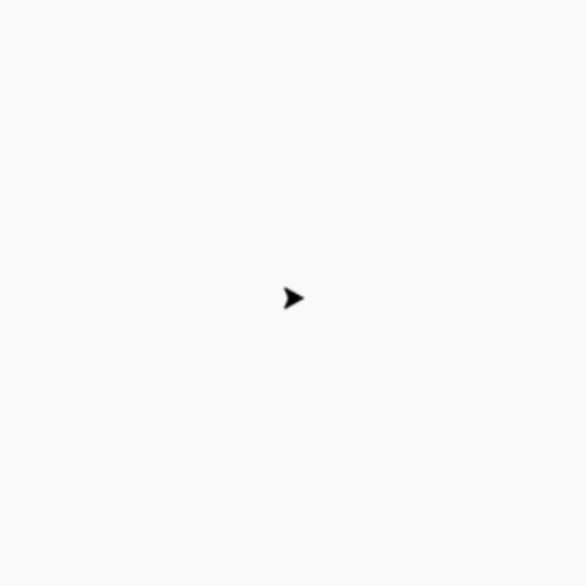

# PYTHON LIBRARY TURTLE

### Daftar isi
- Pendahuluan
- Turtle Motion
    - Left & Right
    - Forward & Backward
    - Setposition
    - Setx & Sety
    - Setheading
    - Home
    - Circle
    - dot
    - stamp & clearstamp
    - undo & speed
- Turtle Tell State
    - position
    - xcor & ycor
    - heading
    - distance
<!-- - Settings for measurement
    - degrees
    - radians -->
- Pen control (Drawing State)
    - pendown & penup
    - penup
    - pensize
    - pen
    - isdown
- Color Control
    - color
    - pencolor
    - fillcolor
    - filling
    - begin_fill & end_fill
- More drawing control
    - reset
    - clear
    - write


### Pendahuluan
Library Turtle adalah salah satu pustaka Python yang paling sering digunakan untuk menggambar grafik sederhana. Dengan menggunakan Turtle, kita bisa menggambar bentuk-bentuk geometris, menggambar pola, hingga membuat animasi dasar. Konsep Turtle didasarkan pada pen yang digerakkan di atas layar, dan dengan memberikan perintah kepada turtle, kita bisa membuatnya bergerak serta menggambar sesuai dengan instruksi.

Turtle menjadi alat yang menyenangkan bagi pemula untuk belajar logika pemrograman dan dasar-dasar koordinat grafis.

Pengenalan Dasar Koordinat
Layar turtle menggunakan sistem koordinat cartesian (x, y) di mana:

Titik (0, 0) adalah pusat layar.
Koordinat positif x mengarah ke kanan.
Koordinat positif y mengarah ke atas.
Nilai negatif untuk x dan y bergerak ke kiri dan bawah.

### Turtle Motion
### - Left & Right

Dalam pemrograman Python, kita bisa menggunakan modul `turtle` untuk menggambar berbagai bentuk dan pola. Dua metode yang sering digunakan untuk mengubah arah pergerakan objek (yang kita sebut sebagai "penyu") adalah `right()` dan `left()`. Berikut penjelasan sederhana mengenai kedua metode ini:

#### 1. Metode `right()`
Metode `right()` digunakan untuk memutar penyu ke arah kanan. Nilai yang kita masukkan ke dalam metode ini adalah sudut (dalam derajat) yang menunjukkan seberapa jauh penyu akan berputar.

**Sintaks:**
```python
turtle.right(angle)
```

- **angle**: Nilai sudut (misalnya 90) yang menunjukkan seberapa jauh penyu akan berputar ke kanan.



**Contoh Penggunaan:**
```python
turtle.right(90)     # Penyu berputar 90 derajat ke kanan
```

**Apa yang terjadi?**
1. Penyu berputar 90 derajat ke kanan (sehingga sekarang menghadap ke bawah layar).


#### 2. Metode `left()`
Metode `left()` digunakan untuk memutar penyu ke arah kiri. Seperti `right()`, kita juga perlu memasukkan nilai sudut yang menunjukkan seberapa jauh penyu akan berputar.

**Sintaks:**
```python
turtle.left(angle)
```

- **angle**: Nilai sudut yang menunjukkan seberapa jauh penyu akan berputar ke kiri.

**Contoh Penggunaan:**
```python
turtle.left(120)     # Penyu berputar 120 derajat ke kiri
```

**Apa yang terjadi?**
1. Kemudian, penyu berputar 120 derajat ke kiri.

Dengan menggunakan metode `right()` dan `left()`, kita dapat mengarahkan penyu ke berbagai arah dan membuat pola yang kita inginkan.


### - Forward & Backward
 Metode `forward()` dan `backward()` adalah dua cara dasar untuk menggerakkan penyu (objek yang menggambar) ke depan dan belakang. Mari kita pelajari cara penggunaannya dengan cara yang mudah dipahami:

#### 1. Metode `forward()`
Metode `forward()` digunakan untuk menggerakkan penyu ke arah depan. Kita perlu memberikan nilai jarak yang ingin ditempuh oleh penyu.

**Sintaks:**
```python
turtle.forward(jarak)
```
- **jarak**: Angka yang menunjukkan seberapa jauh penyu akan bergerak maju. Ini bisa berupa bilangan bulat (integer) atau desimal (float).

**Contoh Penggunaan:**
```python
turtle.forward(100)  # Penyu bergerak maju sejauh 100 unit
```

**Apa yang terjadi?**
- Penyu akan bergerak maju dalam arah yang sedang dihadapinya sejauh 100 unit.

**Catatan:** Kita juga bisa menggunakan `fd()` sebagai pengganti `forward()`. Kedua metode ini melakukan hal yang sama.
```python
turtle.fd(100)  # Sama seperti turtle.forward(100)
```

#### 2. Metode `backward()`
Metode `backward()` digunakan untuk menggerakkan penyu ke arah belakang. Kita juga perlu memberikan nilai jarak yang ingin ditempuh penyu, tetapi kali ini penyu akan bergerak mundur.

**Sintaks:**
```python
turtle.backward(jarak)
```
- **jarak**: Angka yang menunjukkan seberapa jauh penyu akan bergerak mundur.

**Contoh Penggunaan:**
```python
turtle.backward(100)  # Penyu bergerak mundur sejauh 100 unit
```

**Apa yang terjadi?**
- Penyu akan bergerak mundur dalam arah yang berlawanan dengan arah yang sedang dihadapinya sejauh 100 unit.

**Catatan:** Kita juga bisa menggunakan `bk()` atau `back()` sebagai pengganti `backward()`. Ketiga metode ini melakukan hal yang sama.
```python
turtle.bk(100)    # Sama seperti turtle.backward(100)
turtle.back(100)  # Sama seperti turtle.backward(100)
```

Dengan memahami metode `forward()` dan `backward()`, kita bisa mengontrol pergerakan penyu dalam menggambar bentuk dan pola pada layar.

### - Setposition
Metode `goto()` digunakan untuk memindahkan penyu (turtle) ke posisi tertentu pada layar. Ini adalah cara yang lebih langsung untuk menempatkan penyu di posisi koordinat yang diinginkan. Metode ini juga memiliki alias atau nama lain, yaitu `setpos()` dan `setposition()`, yang semuanya berfungsi dengan cara yang sama.

#### Sintaks:
```python
turtle.goto(x, y)
```
Alias:
```python
turtle.setpos(x, y)
turtle.setposition(x, y)
```

#### Parameter:
- **x**: Koordinat x pada layar.
- **y**: Koordinat y pada layar.

#### Bagaimana Cara Kerjanya?
- Metode ini akan memindahkan penyu langsung ke titik (x, y) yang ditentukan.
- Titik (0, 0) biasanya adalah titik tengah layar, sehingga nilai `x` dan `y` menentukan posisi relatif terhadap titik tengah tersebut.

#### Contoh Penggunaan:
```python
turtle.goto(100, 100)  # Penyu bergerak ke posisi (100, 100)
```

**Apa yang terjadi?**
- Penyu akan berpindah langsung ke posisi koordinat (100, 100) pada layar.

Metode `goto()`, `setpos()`, dan `setposition()` sangat berguna ketika kita ingin menempatkan penyu di lokasi tertentu dengan cepat, tanpa harus memikirkan arah penyu atau berapa jauh dia harus bergerak.

### - Setx & Sety
Metode `setx()` dan `sety()` digunakan untuk mengubah posisi penyu secara spesifik pada sumbu x atau y, tanpa mengubah posisi pada sumbu lainnya. Ini memungkinkan kita untuk menggerakkan penyu secara horizontal atau vertikal sambil mempertahankan posisi di sumbu lainnya.

#### 1. Metode `setx()`
Metode `setx()` digunakan untuk mengatur posisi penyu pada sumbu x tanpa mengubah posisi pada sumbu y.

**Sintaks:**
```python
turtle.setx(x)
```

- **x**: Nilai koordinat x baru (bisa berupa bilangan bulat atau desimal).

**Contoh Penggunaan:**
```python
turtle.setpos(-100, 100)  # Penyu ditempatkan pada posisi (-100, 100)
turtle.setx(200)          # Penyu bergerak ke posisi (200, 100) tanpa mengubah koordinat y
```

**Apa yang terjadi?**
1. Penyu pertama-tama ditempatkan di koordinat (-100, 100).
2. Kemudian, `setx(200)` mengubah posisi x penyu menjadi 200, sehingga penyu bergerak ke posisi (200, 100), tanpa mengubah posisi y-nya.

#### 2. Metode `sety()`
Metode `sety()` digunakan untuk mengatur posisi penyu pada sumbu y tanpa mengubah posisi pada sumbu x.

**Sintaks:**
```python
turtle.sety(y)
```

- **y**: Nilai koordinat y baru (bisa berupa bilangan bulat atau desimal).

**Contoh Penggunaan:**
```python
turtle.setpos(-100, 100)  # Penyu ditempatkan pada posisi (-100, 100)
turtle.sety(-200)         # Penyu bergerak ke posisi (-100, -200) tanpa mengubah koordinat x
```

**Apa yang terjadi?**
1. Penyu pertama-tama ditempatkan di koordinat (-100, 100).
2. Kemudian, `sety(-200)` mengubah posisi y penyu menjadi -200, sehingga penyu bergerak ke posisi (-100, -200), tanpa mengubah posisi x-nya.

#### Kesimpulan
- **`setx(x)`**: Mengubah posisi penyu hanya pada sumbu x.
- **`sety(y)`**: Mengubah posisi penyu hanya pada sumbu y.

Dengan menggunakan `setx()` dan `sety()`, kita bisa mengontrol posisi penyu secara horizontal dan vertikal dengan lebih spesifik dan terarah.

### - Setheading
Metode `setheading()` digunakan untuk mengubah arah atau orientasi penyu (turtle) ke sudut tertentu dalam derajat. Metode ini memungkinkan kita untuk mengatur arah yang akan dituju oleh penyu dengan lebih tepat. Alias untuk metode ini adalah `seth()`, dan keduanya bekerja dengan cara yang sama.
#### Cara Kerja Orientasi
Dalam `turtle`, arah diukur dalam derajat:
- **0**: Timur
- **90**: Utara
- **180**: Barat
- **270**: Selatan

Ini adalah pengaturan default atau "Standar Mode". Pada mode ini, arah yang diberikan ke metode `setheading()` akan mengubah arah penyu sesuai dengan derajat yang ditentukan.

##### Sintaks:
```python
turtle.setheading(to_angle)
```
Alias:
```python
turtle.seth(to_angle)
```

#### Parameter:
- **to_angle**: Sudut (dalam derajat) yang menunjukkan arah yang ingin dituju oleh penyu. Bisa berupa bilangan bulat (integer) atau desimal (float).

#### Contoh Penggunaan:
```python
turtle.setpos(-100, 100)  # Penyu ditempatkan pada posisi (-100, 100)
turtle.setheading(90)     # Penyu diatur menghadap ke utara
```

**Apa yang terjadi?**
1. Penyu pertama-tama ditempatkan di koordinat (-100, 100).
2. Kemudian, `setheading(90)` mengubah arah penyu sehingga menghadap ke utara (90 derajat).

#### Kesimpulan
- **`setheading(angle)`** atau **`seth(angle)`** digunakan untuk mengatur arah penyu sesuai sudut yang diinginkan.
- Dengan menggunakan metode ini, kita dapat mengontrol orientasi penyu untuk bergerak ke arah yang tepat, baik itu ke timur, barat, utara, selatan, atau sudut tertentu lainnya. 

Metode `setheading()` sangat berguna ketika kita ingin penyu bergerak dalam arah yang spesifik.


### - Home
Metode `home()` digunakan untuk mengembalikan penyu (turtle) ke posisi awal pada layar, yaitu titik asal (0, 0). Selain itu, metode ini juga mengatur ulang arah penyu ke orientasi awalnya, yang biasanya menghadap ke timur (0 derajat).

#### Fungsi dan Manfaat `home()`
- **Posisi:** Mengembalikan penyu ke titik asal (0, 0).
- **Orientasi:** Mengatur arah penyu ke orientasi awal (menghadap ke timur).

#### Sintaks:
```python
turtle.home()
```

#### Contoh Penggunaan:
```python
turtle.setpos(-100, 100)  # Penyu ditempatkan pada posisi (-100, 100)
turtle.home()             # Penyu kembali ke titik asal (0, 0) dan menghadap ke timur
```

**Apa yang terjadi?**
1. Penyu pertama-tama ditempatkan di koordinat (-100, 100).
2. Kemudian, `home()` memindahkan penyu kembali ke titik asal (0, 0) dan mengatur arah penyu menghadap ke timur.

#### Kesimpulan
Metode `home()` sangat berguna ketika kita ingin mengembalikan penyu ke posisi awalnya dengan cepat, tanpa perlu menggunakan metode lain seperti `goto(0, 0)` dan `setheading(0)` secara terpisah.


### - Circle
Metode `circle()` digunakan untuk menggambar lingkaran dengan berbagai variasi seperti ukuran, bagian lingkaran tertentu (busur), dan bentuk poligon. Metode ini sangat fleksibel karena dapat digunakan untuk menggambar lingkaran penuh, busur, atau bentuk poligon sederhana.

#### Sintaks:
```python
turtle.circle(radius, extent=None, steps=None)
```

#### Parameter:
- **radius**: Jari-jari lingkaran. Positif untuk menggambar lingkaran searah jarum jam, negatif untuk berlawanan arah.
- **extent**: (Opsional) Bagian lingkaran dalam derajat. Nilai default adalah `None`, yang berarti menggambar lingkaran penuh (360 derajat). Jika diatur ke nilai tertentu, akan menggambar busur sesuai derajat tersebut.
- **steps**: (Opsional) Menentukan jumlah segmen yang digunakan untuk menggambar lingkaran. Bisa digunakan untuk menggambar poligon. Semakin banyak langkah, semakin halus bentuk lingkaran.

#### Contoh Penggunaan:
##### Contoh 1: Menggambar Lingkaran Penuh dengan Radius 50
```python
turtle.circle(50)  # Menggambar lingkaran dengan jari-jari 50
```
- **Output**: Lingkaran penuh dengan radius 50 unit.

##### Contoh 2: Menggambar Busur Lingkaran dengan Radius 120 dan Extent 180
```python
turtle.circle(120, 180)  # Menggambar busur lingkaran dengan radius 120 dan derajat 180
```
- **Output**: Busur lingkaran (setengah lingkaran) dengan radius 120 unit.

##### Contoh 3: Menggambar Poligon dengan Radius 80 dan 5 Langkah
```python
turtle.circle(80, steps=5)  # Menggambar poligon dengan radius 80 dan 5 sisi
```
- **Output**: Bentuk poligon (segilima) dengan radius 80 unit.

#### Kesimpulan
Metode `circle()` sangat berguna untuk menggambar lingkaran, busur, atau bahkan poligon dengan jumlah sisi yang bisa ditentukan. Dengan mengatur parameter `radius`, `extent`, dan `steps`, kita bisa membuat berbagai macam bentuk sesuai kebutuhan.

### - Dot
Metode `dot()` digunakan untuk menggambar titik melingkar (bulatan) dengan ukuran dan warna tertentu. Metode ini berguna ketika kita ingin menandai titik atau membuat dekorasi kecil pada gambar. Jika ukuran tidak disebutkan, titik akan memiliki ukuran yang sesuai dengan nilai `pensize` yang sedang digunakan.

#### Sintaks:
```python
turtle.dot(size=None, *color)
```

#### Parameter:
- **size**: (Opsional) Ukuran titik dalam piksel. Harus berupa bilangan bulat lebih besar atau sama dengan 1. Jika tidak disebutkan, ukuran titik akan menjadi `pensize + 4` atau `2 * pensize`.
- **color**: (Opsional) Warna titik. Bisa berupa nama warna (seperti `"blue"`, `"red"`), kode heksadesimal (seperti `"#ff0000"`), atau tuple warna numerik (seperti `(255, 0, 0)` untuk warna merah).

#### Contoh Penggunaan:
##### Contoh 1: Menggambar Titik dengan Ukuran Default
```python
turtle.dot()  # Menggambar titik dengan ukuran default
```
- **Output**: Menggambar titik dengan ukuran yang bergantung pada `pensize`.

##### Contoh 2: Menggambar Titik dengan Ukuran 20 dan Warna "blue"
```python
turtle.fd(50)         # Menggerakkan penyu 50 unit ke depan
turtle.dot(20, "blue")  # Menggambar titik berwarna biru dengan ukuran 20
turtle.fd(50)         # Menggerakkan penyu 50 unit ke depan
```
- **Output**: Penyu akan bergerak maju 50 unit, menggambar titik berwarna biru dengan ukuran 20, kemudian bergerak maju lagi 50 unit.

#### Kesimpulan
Metode `dot()` sangat berguna untuk menggambar titik-titik dengan ukuran dan warna yang dapat dikustomisasi. Ini bisa digunakan untuk membuat pola, menandai posisi tertentu, atau sekadar menghias gambar.

### - stamp & clearstamp
#### 1. **Metode `stamp()`**
Metode `stamp()` digunakan untuk mencap salinan bentuk penyu (turtle) ke kanvas. Bentuk cap ini akan tetap di tempat bahkan setelah penyu bergerak ke posisi lain. Metode ini sangat berguna untuk membuat pola atau jejak di sepanjang jalur penyu. Metode ini tidak memerlukan argumen apa pun dan mengembalikan ID unik dari cap yang dibuat.

- **Sintaks:**
  ```python
  turtle.stamp()
  ```
- **Kegunaan:** Mencap bentuk penyu di lokasi saat ini pada kanvas dan mengembalikan ID cap.

**Contoh 1: Mencap Bentuk Penyu di Lokasi Tertentu**
```python
turtle.forward(100)  # Penyu bergerak maju 100 unit
turtle.stamp()       # Mencap bentuk penyu pada posisi saat ini
turtle.forward(100)  # Penyu bergerak maju 100 unit lagi
```
- **Output:** Penyu bergerak maju, mencap bentuknya di posisi tengah, lalu bergerak maju lagi.

**Contoh 2: Mencap dengan Warna**
```python
turtle.color("blue")       # Mengatur warna penyu menjadi biru
stamp_id = turtle.stamp()  # Mencap bentuk penyu dan menyimpan ID cap
turtle.fd(50)              # Penyu bergerak maju 50 unit
```
- **Output:** Penyu mencap bentuk biru di posisi awal, lalu bergerak maju 50 unit.

#### 2. **Metode `clearstamp()`**
Metode `clearstamp()` digunakan untuk menghapus cap tertentu yang telah dibuat oleh penyu. Metode ini memerlukan ID cap yang ingin dihapus, yang sebelumnya diperoleh dari pemanggilan `stamp()`. 

- **Sintaks:**
  ```python
  turtle.clearstamp(stamp_id)
  ```
- **Parameter:** 
  - **stamp_id:** ID unik dari cap yang akan dihapus. ID ini adalah nilai yang dikembalikan dari metode `stamp()`.

**Contoh: Menghapus Cap dengan ID Tertentu**
```python
turtle.color("blue")       # Mengatur warna penyu menjadi biru
stamp_id = turtle.stamp()  # Mencap bentuk penyu dan menyimpan ID cap
turtle.fd(50)              # Penyu bergerak maju 50 unit
turtle.clearstamp(stamp_id)  # Menghapus cap dengan ID yang disimpan
```
- **Output:** Penyu mencap bentuk biru di posisi awal, bergerak maju, lalu cap biru dihapus menggunakan ID-nya.

#### Kesimpulan
- **`stamp()`**: Mencap salinan bentuk penyu di posisi saat ini dan mengembalikan ID cap.
- **`clearstamp(stamp_id)`**: Menghapus cap dengan ID tertentu yang telah dibuat oleh penyu.

Metode `stamp()` dan `clearstamp()` sangat berguna untuk membuat pola atau efek visual yang melibatkan jejak penyu pada kanvas. Dengan menggabungkan keduanya, kita bisa menciptakan gambar yang dinamis dan interaktif.


### - undo & speed
#### 1. **Metode `undo()`**
Metode `undo()` digunakan untuk membatalkan tindakan terakhir yang dilakukan oleh penyu (turtle). Anda bisa membatalkan beberapa tindakan secara berulang, tergantung pada ukuran buffer undo yang telah ditetapkan. Metode ini tidak memerlukan argumen apa pun.

- **Sintaks:**
  ```python
  turtle.undo()
  ```
- **Kegunaan:** Membatalkan tindakan penyu terakhir.

**Contoh: Membatalkan Tindakan Terakhir**
```python
turtle.forward(100)  # Penyu bergerak maju 100 unit
turtle.left(90)      # Penyu berbelok 90 derajat ke kiri
turtle.forward(100)  # Penyu bergerak maju 100 unit
turtle.undo()        # Membatalkan tindakan terakhir (bergerak maju 100 unit)
```
- **Output:** Penyu pertama-tama bergerak maju, lalu berbelok, kemudian bergerak maju lagi. Setelah `undo()`, penyu kembali ke posisi sebelum langkah terakhir.
  
Jika `undo()` dihapus, maka penyu akan tetap maju 100 unit terakhir:
```python
turtle.forward(100)
turtle.left(90)
turtle.forward(100)
```
- **Output:** Penyu akan bergerak maju, berbelok, dan maju lagi tanpa ada pembatalan tindakan.

#### 2. **Metode `speed()`**
Metode `speed()` digunakan untuk mengatur kecepatan gerakan penyu. Metode ini dapat mempercepat atau memperlambat animasi gerakan penyu di layar, membuatnya lebih interaktif dan sesuai dengan kebutuhan visualisasi.

- **Sintaks:**
  ```python
  turtle.speed(speed=None)
  ```
- **Parameter:**
  - **speed**: Angka antara 0 dan 10, atau string yang menunjukkan tingkat kecepatan seperti `'fastest'`, `'fast'`, `'normal'`, `'slow'`, `'slowest'`.

- **Keterangan:**
  - `0`: **'fastest'** – Tidak ada animasi, langsung menggambar.
  - `1`: **'slowest'** – Kecepatan paling lambat.
  - `10`: **'fast'** – Kecepatan sangat cepat.
  - `None`: Jika tidak ada nilai yang diberikan, metode ini akan mengembalikan kecepatan saat ini.

**Contoh: Mengatur Kecepatan Penyu**
```python
turtle.speed(1)        # Penyu bergerak dengan kecepatan paling lambat
turtle.forward(100)    # Penyu bergerak maju 100 unit
turtle.speed('fast')   # Mengatur kecepatan menjadi sangat cepat
turtle.right(90)       
turtle.forward(100)    # Penyu bergerak maju 100 unit dengan cepat
```
- **Output:** Penyu pertama-tama bergerak maju dengan lambat, kemudian setelah mengubah kecepatan menjadi 'fast', penyu bergerak maju dengan lebih cepat.

#### Kesimpulan
- **`undo()`**: Membatalkan tindakan terakhir dari penyu. Dapat digunakan berulang untuk membatalkan beberapa tindakan sebelumnya.
- **`speed()`**: Mengatur atau mengembalikan kecepatan penyu. Membuat animasi lebih dinamis dengan memilih kecepatan yang sesuai (dari 'slowest' hingga 'fastest').

Metode `undo()` berguna untuk koreksi dan pengeditan, sementara `speed()` memungkinkan kontrol lebih besar terhadap animasi dan kecepatan gambar.

### Turtle Tell State
### - position
Metode `pos()` atau `position()` digunakan untuk mendapatkan lokasi penyu (turtle) saat ini dalam bentuk koordinat (x, y) sebagai vektor 2D (`Vec2D`). Metode ini berguna ketika kita perlu mengetahui posisi penyu di kanvas, terutama saat melakukan perhitungan atau membuat pola yang bergantung pada lokasi penyu.

- **Alias:** `pos()` dan `position()`
- **Sintaks:**
  ```python
  turtle.pos()
  ```
  atau
  ```python
  turtle.position()
  ```
- **Return Value:** Mengembalikan posisi penyu saat ini dalam format `(x, y)`.

#### Keterangan:
- Fungsi ini tidak memerlukan argumen.
- Posisi default penyu di awal adalah `(0, 0)`, yaitu titik pusat kanvas.

#### Contoh Penggunaan:
```python
turtle.forward(100)  # Penyu bergerak maju 100 unit
current_position = turtle.pos()  # Mendapatkan posisi saat ini
print(current_position)  # Menampilkan posisi penyu saat ini
```
- **Output:** `(100.00, 0.00)`  
  Penyu bergerak 100 unit ke depan dari posisi awal `(0, 0)`, sehingga posisinya sekarang adalah `(100, 0)`.

#### Kesimpulan
Metode `pos()` atau `position()` sangat berguna untuk mengetahui lokasi penyu pada kanvas dalam bentuk koordinat `(x, y)`. Ini membantu dalam perhitungan posisi dan membuat pola yang kompleks berdasarkan posisi penyu yang ada.


### - xcor & ycor

#### 1. **Metode `xcor()`**
Metode `xcor()` digunakan untuk mendapatkan koordinat x penyu (turtle) dari posisi saat ini. Metode ini tidak memerlukan argumen dan mengembalikan nilai x dari posisi penyu dalam format angka.

- **Sintaks:**
  ```python
  turtle.xcor()
  ```
- **Return Value:** Mengembalikan koordinat x penyu saat ini.

**Contoh: Mendapatkan Koordinat x**
```python
turtle.left(50)       # Penyu berbelok 50 derajat
turtle.forward(100)   # Penyu bergerak maju 100 unit
print(round(turtle.xcor(), 5))  # Menampilkan koordinat x penyu dengan pembulatan 5 desimal
```
- **Output:** Misalnya, `100.0` jika penyu bergerak 100 unit ke arah x dari posisi awal. Nilai ini bisa berbeda tergantung pada pergerakan penyu.

#### 2. **Metode `ycor()`**
Metode `ycor()` digunakan untuk mendapatkan koordinat y penyu dari posisi saat ini. Metode ini tidak memerlukan argumen dan mengembalikan nilai y dari posisi penyu dalam format angka.

- **Sintaks:**
  ```python
  turtle.ycor()
  ```
- **Return Value:** Mengembalikan koordinat y penyu saat ini.

**Contoh: Mendapatkan Koordinat y**
```python
turtle.left(60)       # Penyu berbelok 60 derajat
turtle.forward(100)   # Penyu bergerak maju 100 unit
print(round(turtle.ycor(), 3))  # Menampilkan koordinat y penyu dengan pembulatan 3 desimal
```
- **Output:** Misalnya, `86.60` jika penyu bergerak 100 unit dalam arah y dari posisi awal. Nilai ini bisa berbeda tergantung pada pergerakan penyu.

#### Kesimpulan
- **`xcor()`**: Mengembalikan koordinat x dari posisi penyu saat ini. Berguna untuk mengetahui seberapa jauh penyu bergerak di sepanjang sumbu x.
- **`ycor()`**: Mengembalikan koordinat y dari posisi penyu saat ini. Berguna untuk mengetahui seberapa jauh penyu bergerak di sepanjang sumbu y.

Kedua metode ini membantu dalam pelacakan posisi penyu di kanvas dan dapat digunakan untuk analisis atau pembuatan pola berdasarkan koordinat penyu.


### - Heading
Metode `heading()` digunakan untuk mendapatkan arah (orientasi) penyu (turtle) saat ini dalam derajat. Arah ini menunjukkan sudut yang dibentuk penyu dari sumbu x positif (Timur) dalam arah jarum jam.

- **Sintaks:**
  ```python
  turtle.heading()
  ```
- **Return Value:** Mengembalikan arah penyu saat ini dalam derajat (0 hingga 360).

**Contoh: Mendapatkan Arah Penyu**
```python
turtle.left(47)  # Penyu berbelok 47 derajat ke kiri
current_heading = turtle.heading()  # Mendapatkan arah penyu saat ini
print(current_heading)  # Menampilkan arah penyu dalam derajat
```
- **Output:** Misalnya, `47.0` jika penyu telah berbelok 47 derajat dari posisi awal.

#### Penjelasan:
- **Default Heading:** Jika penyu baru diinisialisasi, arah default adalah 0 derajat (Timur).
- **Perubahan Arah:** Saat penyu berbelok menggunakan metode seperti `left()` atau `right()`, arah penyu akan berubah sesuai derajat yang ditentukan.

#### Kesimpulan
- **`heading()`**: Mengembalikan arah penyu saat ini dalam derajat. Ini membantu untuk menentukan orientasi penyu dan dapat digunakan untuk perhitungan atau pengaturan arah gerakan berikutnya.

Metode ini sangat berguna untuk mengontrol dan memeriksa arah penyu saat menggambar atau membuat pola.

### - Distance
Metode `distance()` digunakan untuk menghitung jarak antara penyu (turtle) dengan titik tertentu di kanvas atau dengan penyu lain. Metode ini mengembalikan jarak dalam satuan langkah penyu.

- **Sintaks:**
  ```python
  turtle.distance(x, y=None)
  ```
  atau
  ```python
  turtle.distance((x, y))
  ```
  atau
  ```python
  turtle.distance(vec)
  ```
  atau
  ```python
  turtle.distance(mypen)
  ```

- **Parameter:**
  - **x**: Koordinat x dari titik tujuan.
  - **y**: Koordinat y dari titik tujuan (jika tidak disebutkan, metode ini menganggap `x` adalah tupel koordinat).
  - **vec**: Tupel koordinat `(x, y)` atau vektor yang dikembalikan oleh metode lain seperti `pos()`.
  - **mypen**: Penyu lain yang posisinya akan dibandingkan dengan posisi penyu saat ini.

**Contoh Penggunaan:**

**Contoh 1: Menghitung Jarak ke Titik Koordinat**
```python
turtle.forward(77)  # Penyu bergerak maju 77 unit
distance_to_point = turtle.distance(100, 100)  # Menghitung jarak ke titik (100, 100)
print(distance_to_point)  # Menampilkan jarak ke titik tersebut
```
- **Output:** Misalnya, `118.6` jika jarak dari posisi penyu saat ini ke titik (100, 100) adalah 118.6 unit.

**Contoh 2: Menghitung Jarak ke Penyu Lain**
```python
joe = turtle.Turtle()  # Membuat penyu baru bernama joe
joe.forward(77)        # Joe bergerak maju 77 unit
distance_to_joe = turtle.distance(joe)  # Menghitung jarak ke penyu joe
print(distance_to_joe)  # Menampilkan jarak ke penyu joe
```
- **Output:** `77.0` jika penyu `joe` berada 77 unit dari penyu saat ini (karena `joe` bergerak maju 77 unit dari posisi awal).

#### Penjelasan:
- **Jarak ke Titik Koordinat:** Anda bisa mengukur jarak dari penyu ke titik (x, y) dengan memberikan kedua koordinat tersebut.
- **Jarak ke Vektor:** Jika anda ingin mengukur jarak ke posisi lain, seperti hasil dari `pos()`, cukup berikan vektor `(x, y)`.
- **Jarak ke Penyu Lain:** Jika ingin mengukur jarak ke penyu lain, cukup berikan objek penyu sebagai argumen.

#### Kesimpulan
- **`distance()`**: Menghitung dan mengembalikan jarak dari penyu saat ini ke titik tertentu, vektor, atau penyu lain. Berguna untuk perhitungan geometris dan navigasi.

### Pen control (Drawing State)
### - pendown & penup

#### a) **`pendown()` | `pd()` | `down()`**

Metode `pendown()` digunakan untuk menurunkan pena penyu ke kanvas, sehingga saat penyu bergerak, pena akan meninggalkan jejak atau garis pada layar. Metode ini tidak memerlukan argumen apa pun dan bisa dipanggil dengan beberapa nama alias.

- **Sintaks:**
  ```python
  turtle.pendown()
  ```
  atau
  ```python
  turtle.pd()
  ```
  atau
  ```python
  turtle.down()
  ```

**Contoh: Menurunkan Pena dan Menggambar**
```python
turtle.forward(50)  # Penyu bergerak maju 50 unit
turtle.penup()      # Mengangkat pena, sehingga tidak menggambar
turtle.forward(50)  # Penyu bergerak maju 50 unit tanpa menggambar
turtle.pendown()    # Menurunkan pena, sehingga akan menggambar lagi
turtle.forward(50)  # Penyu bergerak maju 50 unit dan menggambar
```
- **Output:** Hanya garis pertama dan terakhir yang digambar. Garis kedua tidak digambar karena pena diangkat dengan `penup()`.

#### b) **`penup()` | `pu()` | `up()`**

Metode `penup()` digunakan untuk mengangkat pena dari kanvas, sehingga saat penyu bergerak, pena tidak akan meninggalkan jejak atau garis pada layar. Metode ini juga tidak memerlukan argumen dan memiliki beberapa alias.

- **Sintaks:**
  ```python
  turtle.penup()
  ```
  atau
  ```python
  turtle.pu()
  ```
  atau
  ```python
  turtle.up()
  ```

**Contoh: Mengangkat Pena dan Berpindah**
```python
turtle.forward(50)  # Penyu bergerak maju 50 unit dan menggambar
turtle.penup()      # Mengangkat pena, sehingga tidak menggambar
turtle.forward(50)  # Penyu bergerak maju 50 unit tanpa menggambar
turtle.pendown()    # Menurunkan pena, sehingga akan menggambar lagi
turtle.forward(50)  # Penyu bergerak maju 50 unit dan menggambar
```
- **Output:** Garis pertama dan terakhir digambar. Bagian tengah tidak digambar karena pena diangkat dengan `penup()`.

#### Penjelasan:
- **`pendown()`**: Menurunkan pena sehingga penyu menggambar saat bergerak.
- **`penup()`**: Mengangkat pena sehingga penyu tidak menggambar saat bergerak.

Dengan menggunakan `pendown()` dan `penup()`, Anda dapat mengontrol kapan penyu akan menggambar dan kapan tidak, memungkinkan Anda untuk membuat gambar yang lebih kompleks dengan memindahkan penyu tanpa meninggalkan jejak jika tidak diinginkan.


### - pensize

Metode `pensize()` dan `width()` digunakan untuk mengatur atau mengembalikan ketebalan garis yang digambar oleh penyu (turtle). Anda bisa mengubah ketebalan garis untuk efek visual yang berbeda saat menggambar.

- **Sintaks:**
  ```python
  turtle.pensize(width=None)
  ```
  atau
  ```python
  turtle.width(width=None)
  ```

- **Parameter:**
  - **width**: Bilangan bulat atau float yang menentukan ketebalan garis dalam piksel. Jika tidak ada argumen yang diberikan, metode ini mengembalikan ketebalan garis saat ini.

**Contoh: Mengatur dan Mengembalikan Ketebalan Garis**

**Contoh 1: Mengembalikan Ketebalan Garis**
```python
turtle.pensize()  # Mengembalikan ketebalan garis saat ini
```
- **Output:** Nilai default ketebalan garis, misalnya `1`.

**Contoh 2: Mengatur Ketebalan Garis**
```python
turtle.forward(100)     # Penyu bergerak maju 100 unit dengan ketebalan garis default
turtle.left(50)         # Penyu berbelok 50 derajat
turtle.pensize(10)      # Mengatur ketebalan garis menjadi 10 piksel
turtle.forward(100)     # Penyu bergerak maju 100 unit dengan ketebalan garis baru
```
- **Output:** Garis pertama digambar dengan ketebalan default, sedangkan garis kedua digambar dengan ketebalan 10 piksel.

#### Penjelasan:
- **`pensize(width)`** atau **`width(width)`**: Digunakan untuk mengatur ketebalan garis. Jika `width` tidak diberikan, metode ini hanya mengembalikan ketebalan garis saat ini.
- **Default Width:** Ketebalan garis default biasanya adalah `1`.

#### Kesimpulan
- **`pensize(width)`** dan **`width(width)`** memungkinkan Anda untuk mengatur ketebalan garis yang digunakan oleh penyu saat menggambar. Ini memberikan fleksibilitas dalam menciptakan gambar dengan garis yang berbeda ketebalannya, sesuai dengan kebutuhan desain.

### - pen

Metode `pen()` digunakan untuk mengatur atau mengembalikan berbagai atribut pena penyu (turtle) dengan menggunakan kamus atau argumen kata kunci. Ini memungkinkan Anda untuk mengatur beberapa atribut pena dalam satu pernyataan, membuatnya lebih efisien.

- **Sintaks:**
  ```python
  turtle.pen(pen=None, **pendict)
  ```
  atau
  ```python
  turtle.pen(**pendict)
  ```

- **Parameter:**
  - **pen**: Kamus (`dictionary`) yang berisi pasangan kunci/nilai dengan atribut pena yang ingin diatur. 
  - **pendict**: Argumen kata kunci (`keyword arguments`) yang dapat mencakup atribut pena.

**Atribut Pena yang Dapat Diatur:**
- `"shown"`: `True` atau `False` – Menampilkan atau menyembunyikan pena.
- `"pendown"`: `True` atau `False` – Menurunkan atau mengangkat pena.
- `"pencolor"`: String warna atau tuple warna – Mengatur warna garis pena.
- `"fillcolor"`: String warna atau tuple warna – Mengatur warna isi pena.
- `"pensize"`: Bilangan positif – Mengatur ketebalan garis pena.
- `"speed"`: Angka dalam rentang 0 hingga 10 – Mengatur kecepatan penyu.
- `"resizemode"`: `"auto"`, `"user"`, atau `"noresize"` – Menentukan mode perubahan ukuran.
- `"stretchfactor"`: Tuple (bilangan positif, bilangan positif) – Faktor peregangan bentuk.
- `"shearfactor"`: Bilangan – Faktor geser bentuk.
- `"outline"`: Bilangan positif – Ketebalan garis tepi bentuk.
- `"tilt"`: Bilangan – Sudut kemiringan bentuk.

**Contoh Penggunaan:**

**Contoh 1: Mengatur Beberapa Atribut Pena**
```python
turtle.pen(fillcolor="black", pencolor="red", pensize=10)  # Mengatur beberapa atribut pena
turtle.forward(100)   # Penyu bergerak maju 100 unit dengan atribut pena yang baru
turtle.left(50)       # Penyu berbelok 50 derajat
turtle.forward(100)   # Penyu bergerak maju 100 unit
```
- **Output:** Garis yang digambar berwarna merah dengan ketebalan 10 piksel, dan area yang diisi berwarna hitam.

**Contoh 2: Menggunakan Kamus untuk Mengatur Atribut Pena**
```python
pen_attributes = {
    "fillcolor": "blue",
    "pencolor": "green",
    "pensize": 5,
    "speed": 8
}
turtle.pen(pen=pen_attributes)  # Mengatur atribut pena dengan kamus
turtle.forward(100)   # Penyu bergerak maju 100 unit dengan atribut pena yang baru
```
- **Output:** Garis yang digambar berwarna hijau dengan ketebalan 5 piksel, area yang diisi berwarna biru, dan kecepatan penyu adalah 8.

#### Penjelasan:
- **`pen()`**: Metode ini sangat berguna untuk mengatur beberapa atribut pena sekaligus dengan menggunakan kamus atau argumen kata kunci, membuat pengaturan menjadi lebih ringkas dan efisien.
- **Penggunaan Atribut**: Anda dapat mengatur warna, ketebalan, kecepatan, dan berbagai atribut pena lainnya untuk mendapatkan efek visual yang diinginkan pada gambar yang dibuat oleh penyu. 

#### Kesimpulan
- **`pen()`**: Memungkinkan Anda untuk mengatur beberapa atribut pena sekaligus, atau mengembalikannya jika tidak ada argumen yang diberikan. Ini memberikan fleksibilitas dalam mengontrol bagaimana penyu menggambar di layar.

### - isdown

Metode `isdown()` digunakan untuk memeriksa apakah pena penyu (turtle) sedang turun atau tidak. Ini mengembalikan nilai boolean yang menunjukkan status pena.

- **Sintaks:**
  ```python
  turtle.isdown()
  ```

- **Return:**
  - **`True`**: Jika pena sedang turun (artinya pena menempel pada kanvas dan akan menggambar saat penyu bergerak).
  - **`False`**: Jika pena sedang diangkat (artinya pena tidak menempel pada kanvas dan tidak akan menggambar saat penyu bergerak).

**Contoh Penggunaan:**

**Contoh 1: Memeriksa Status Pena**
```python
turtle.penup()          # Mengangkat pena
print(turtle.isdown()) # Output: False

turtle.pendown()        # Menurunkan pena
print(turtle.isdown()) # Output: True
```
- **Output:** Menampilkan `False` saat pena diangkat dan `True` saat pena diturunkan.

**Contoh 2: Menggunakan `isdown()` dalam Logika Program**
```python
if not turtle.isdown():
    turtle.pendown()  # Menurunkan pena jika pena sedang diangkat

turtle.forward(100)   # Gambar garis jika pena sudah turun
```
- **Output:** Garis akan digambar hanya jika pena sebelumnya diangkat, sehingga pena harus diturunkan terlebih dahulu sebelum menggambar.

#### Penjelasan:
- **`isdown()`**: Berguna untuk memeriksa status pena penyu dan dapat digunakan dalam logika program untuk memastikan pena berada dalam posisi yang diinginkan sebelum melakukan aksi seperti menggambar atau memindahkan penyu.

#### Kesimpulan
- **`isdown()`**: Metode ini memberikan cara cepat untuk memeriksa apakah pena sedang aktif menggambar atau tidak, membantu dalam mengelola status pena dalam berbagai situasi saat menggunakan Turtle.

### Color Control
### - color

Metode `color()` digunakan untuk mengubah warna penyu (turtle) pada kanvas. Anda dapat mengatur warna garis (pen) dan warna isi (fill) dengan metode ini.

- **Sintaks:**
  ```python
  turtle.color(*args)
  ```

- **Format Argumen:**
  - **`turtle.color(colorstring)`**: Mengatur warna garis dan warna isi menggunakan nama warna sebagai string. Contoh: `"red"`, `"blue"`, dll.
  - **`turtle.color((r, g, b))`** atau **`turtle.color(r, g, b)`**: Mengatur warna garis dan warna isi menggunakan kode warna RGB. `r`, `g`, dan `b` adalah nilai integer dalam rentang 0 hingga 255.

**Contoh Penggunaan:**

**Contoh 1: Mengatur Warna Menggunakan Nama Warna**
```python
turtle.forward(50)    # Gambar garis maju 50 unit dengan warna default (hitam)
turtle.color("red")   # Ubah warna garis menjadi merah
turtle.forward(50)    # Gambar garis maju 50 unit dengan warna merah
```
- **Output:** Garis pertama akan berwarna hitam, sedangkan garis kedua akan berwarna merah.

**Contoh 2: Mengatur Warna Menggunakan Kode RGB**
```python
turtle.forward(50)              # Gambar garis maju 50 unit dengan warna default (hitam)
turtle.color((0, 255, 0))       # Ubah warna garis menjadi hijau menggunakan kode RGB
turtle.forward(50)              # Gambar garis maju 50 unit dengan warna hijau
```
- **Output:** Garis pertama akan berwarna hitam, sedangkan garis kedua akan berwarna hijau.

#### Penjelasan:
- **`color()`**: Metode ini mengatur warna garis dan warna isi penyu. Anda dapat menggunakan nama warna dalam bentuk string atau kode warna RGB.
- **Nama Warna**: Misalnya, `"blue"`, `"green"`, `"yellow"`.
- **Kode RGB**: Format `(r, g, b)` di mana `r`, `g`, dan `b` masing-masing adalah nilai untuk merah, hijau, dan biru, dengan rentang 0 hingga 255.

#### Kesimpulan
- **`color()`**: Memungkinkan Anda untuk mengubah warna garis dan warna isi penyu dengan menggunakan nama warna atau kode warna RGB, memberikan fleksibilitas dalam mendesain dan mewarnai gambar yang dibuat oleh penyu.


### - pencolor
Metode `pencolor()` digunakan untuk mengubah warna tinta dari garis yang digambar oleh penyu (turtle). Warna defaultnya adalah hitam. Ini hanya mempengaruhi warna garis yang digambar, bukan warna isi.

- **Sintaks:**
  ```python
  turtle.pencolor(*args)
  ```

- **Argumen:**
  - **`colorstring`**: (Opsional) Nama warna sebagai string, seperti `"red"`, `"green"`, dll.
  - **`(r, g, b)`** atau **`r, g, b`**: (Opsional) Tupel tiga nilai `r`, `g`, dan `b` menggunakan kode warna RGB, di mana masing-masing nilai adalah integer dalam rentang 0 hingga 255.

**Contoh Penggunaan:**

**Contoh 1: Mengubah Warna Garis Menggunakan Nama Warna**
```python
turtle.forward(50)       # Gambar garis maju 50 unit dengan warna default (hitam)
turtle.pencolor("red")   # Ubah warna garis menjadi merah
turtle.forward(50)       # Gambar garis maju 50 unit dengan warna merah
turtle.left(90)          # Belok 90 derajat
turtle.forward(50)       # Gambar garis maju 50 unit dengan warna merah
```
- **Output:** Garis pertama berwarna hitam, sedangkan garis berikutnya berwarna merah.

**Contoh 2: Mengubah Warna Garis Menggunakan Kode RGB**
```python
turtle.forward(50)            # Gambar garis maju 50 unit dengan warna default (hitam)
turtle.pencolor((0, 255, 0))  # Ubah warna garis menjadi hijau menggunakan kode RGB
turtle.forward(50)            # Gambar garis maju 50 unit dengan warna hijau
turtle.left(90)               # Belok 90 derajat
turtle.forward(50)            # Gambar garis maju 50 unit dengan warna hijau
```
- **Output:** Garis pertama berwarna hitam, sedangkan garis berikutnya berwarna hijau.

#### Penjelasan:
- **`pencolor()`**: Metode ini digunakan untuk mengatur warna tinta garis yang digambar oleh penyu. Anda dapat menggunakan nama warna atau kode warna RGB untuk menentukan warna garis.
- **Nama Warna**: Misalnya, `"blue"`, `"yellow"`, `"purple"`.
- **Kode RGB**: Format `(r, g, b)` di mana `r`, `g`, dan `b` adalah nilai untuk merah, hijau, dan biru, masing-masing dalam rentang 0 hingga 255.

#### Kesimpulan
- **`pencolor()`**: Memungkinkan Anda untuk mengubah warna garis yang digambar oleh penyu, memberikan kontrol lebih besar atas estetika gambar yang dibuat oleh penyu.


### - fillcolor

Metode `fillcolor()` digunakan untuk mengatur atau mengembalikan warna isian untuk bentuk yang digambar oleh penyu (turtle). Jika penyu menggambar bentuk poligon, warna isian akan diterapkan ke dalam bentuk tersebut.

- **Sintaks:**
  ```python
  turtle.fillcolor(*args)
  ```

- **Parameter:**
  - **`fillcolor()`**: Mengembalikan warna isian saat ini sebagai string spesifikasi warna atau format angka hex.
  - **`fillcolor(colorstring)`**: Menetapkan warna isian menggunakan string spesifikasi warna, seperti `"red"`, `"yellow"`, dll.
  - **`fillcolor((r, g, b))`**: Menetapkan warna isian menggunakan kode warna RGB dalam bentuk tupel `(r, g, b)`, di mana `r`, `g`, dan `b` adalah nilai integer dari 0 hingga 255.
  - **`fillcolor(r, g, b)`**: Menetapkan warna isian menggunakan kode warna RGB dengan nilai `r`, `g`, dan `b` sebagai integer dari 0 hingga 255.

**Contoh Penggunaan:**

**Contoh 1: Mengatur Warna Isian Menggunakan Nama Warna**
```python
turtle.shape("turtle")    # Mengubah bentuk penyu menjadi "turtle"
turtle.fillcolor("blue")  # Menetapkan warna isian menjadi biru
turtle.begin_fill()       # Mulai mengisi bentuk dengan warna
turtle.circle(50)         # Menggambar lingkaran dengan jari-jari 50
turtle.end_fill()         # Mengakhiri proses pengisian
```
- **Output:** Lingkaran biru yang diisi dengan warna biru.

**Contoh 2: Mengatur Warna Isian Menggunakan Kode RGB**
```python
turtle.shape("turtle")           # Mengubah bentuk penyu menjadi "turtle"
turtle.fillcolor((255, 0, 0))    # Menetapkan warna isian menjadi merah menggunakan kode RGB
turtle.begin_fill()              # Mulai mengisi bentuk dengan warna
turtle.circle(50)                # Menggambar lingkaran dengan jari-jari 50
turtle.end_fill()                # Mengakhiri proses pengisian
```
- **Output:** Lingkaran merah yang diisi dengan warna merah.

#### Penjelasan:
- **`fillcolor()`**: Metode ini digunakan untuk menetapkan warna isian pada bentuk yang digambar oleh penyu. Anda bisa menggunakan nama warna atau kode RGB.
- **`begin_fill()` dan `end_fill()`**: Digunakan untuk menandai awal dan akhir pengisian warna dalam bentuk yang digambar.

#### Kesimpulan
- **`fillcolor()`**: Memungkinkan Anda untuk mengatur warna isian pada bentuk yang digambar oleh penyu, memberikan kemampuan untuk membuat gambar yang lebih berwarna dan menarik.

### - filling

Metode `filling()` digunakan untuk memeriksa status pengisian warna pada bentuk yang sedang digambar oleh penyu (turtle). Fungsi ini mengembalikan nilai boolean yang menunjukkan apakah proses pengisian warna sedang berlangsung.

- **Sintaks:**
  ```python
  turtle.filling()
  ```

- **Parameter:**
  - Tidak memerlukan argumen apa pun.

- **Return:**
  - **`True`**: Jika proses pengisian warna sedang berlangsung.
  - **`False`**: Jika tidak ada proses pengisian warna yang sedang berlangsung.

**Contoh Penggunaan:**

**Contoh 1: Memeriksa Status Pengisian Secara Default**
```python
print(turtle.filling())
```
- **Output:** `False`  
  (Status default adalah tidak mengisi, jadi pengisian tidak aktif.)

**Contoh 2: Memeriksa Status Pengisian Setelah Memulai Proses Pengisian**
```python
turtle.begin_fill()      # Mulai proses pengisian warna
print(turtle.filling())  # Memeriksa status pengisian
```
- **Output:** `True`  
  (Status pengisian aktif setelah `begin_fill()` dipanggil.)

#### Penjelasan:
- **`begin_fill()`**: Digunakan untuk memulai proses pengisian warna pada bentuk yang digambar.
- **`end_fill()`**: Digunakan untuk mengakhiri proses pengisian warna pada bentuk tersebut.
- **`filling()`**: Memungkinkan Anda untuk memeriksa apakah proses pengisian warna aktif atau tidak.

#### Kesimpulan
- **`filling()`**: Berguna untuk memeriksa status apakah penyu sedang dalam proses mengisi bentuk dengan warna atau tidak. Ini membantu dalam memahami dan mengelola proses pengisian warna saat menggambar bentuk.

### - begin_fill & end_fill

Metode `begin_fill()` dan `end_fill()` digunakan bersama untuk mengisi bentuk yang digambar oleh penyu (turtle) dengan warna yang telah ditentukan. Proses ini membuat bagian dalam bentuk yang digambar menjadi berwarna sesuai dengan warna yang telah ditetapkan.

#### a) `begin_fill()`
Metode ini digunakan untuk memulai proses pengisian warna pada bentuk yang akan digambar. Metode ini harus dipanggil sebelum menggambar bentuk yang ingin diisi.

- **Sintaks:**
  ```python
  turtle.begin_fill()
  ```

- **Contoh Penggunaan:**

**Contoh 1: Mengisi Lingkaran dengan Warna**
```python
turtle.color("red")        # Menetapkan warna isian menjadi merah
turtle.begin_fill()        # Mulai proses pengisian warna
turtle.circle(80)          # Menggambar lingkaran dengan jari-jari 80
turtle.end_fill()          # Mengakhiri proses pengisian warna
```
- **Output:** Lingkaran merah yang diisi dengan warna merah.

**Contoh 2: Tanpa `begin_fill()`**
```python
turtle.color("red")        # Menetapkan warna isian menjadi merah
# turtle.begin_fill()      # Tidak memanggil begin_fill(), jadi pengisian tidak dimulai
turtle.circle(80)          # Menggambar lingkaran
turtle.end_fill()          # Mengakhiri proses pengisian
```
- **Output:** Lingkaran akan digambar tetapi tidak terisi dengan warna merah, karena `begin_fill()` tidak dipanggil.

#### b) `end_fill()`
Metode ini digunakan untuk mengakhiri proses pengisian warna yang telah dimulai dengan `begin_fill()`. Setelah `end_fill()` dipanggil, bentuk yang digambar diisi dengan warna yang telah ditentukan.

- **Sintaks:**
  ```python
  turtle.end_fill()
  ```

- **Contoh Penggunaan:**

**Contoh 1: Mengisi Lingkaran dengan Warna**
```python
turtle.color("red")        # Menetapkan warna isian menjadi merah
turtle.begin_fill()        # Mulai proses pengisian warna
turtle.circle(80)          # Menggambar lingkaran dengan jari-jari 80
turtle.end_fill()          # Mengakhiri proses pengisian warna
```
- **Output:** Lingkaran merah yang diisi dengan warna merah.

#### Penjelasan:
- **`begin_fill()`**: Memulai proses pengisian warna. Metode ini harus dipanggil sebelum menggambar bentuk yang ingin diisi.
- **`end_fill()`**: Mengakhiri proses pengisian warna dan mengisi bagian dalam bentuk yang telah digambar dengan warna yang telah ditentukan.

#### Kesimpulan:
- **`begin_fill()` dan `end_fill()`**: Digunakan bersama untuk mengisi bentuk yang digambar dengan warna yang telah ditentukan. `begin_fill()` harus dipanggil sebelum menggambar bentuk, dan `end_fill()` setelah menggambar bentuk untuk mengisi bagian dalamnya.
