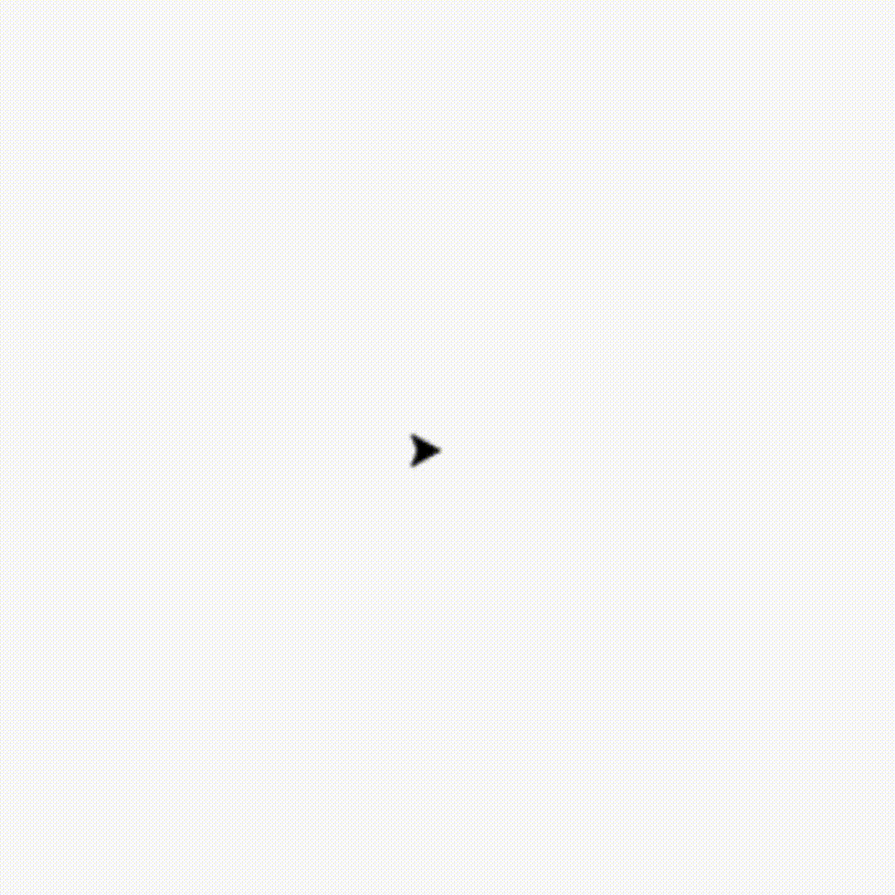
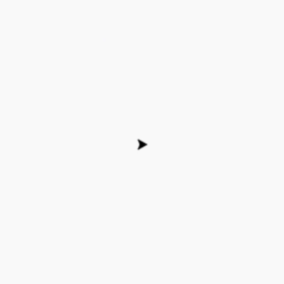
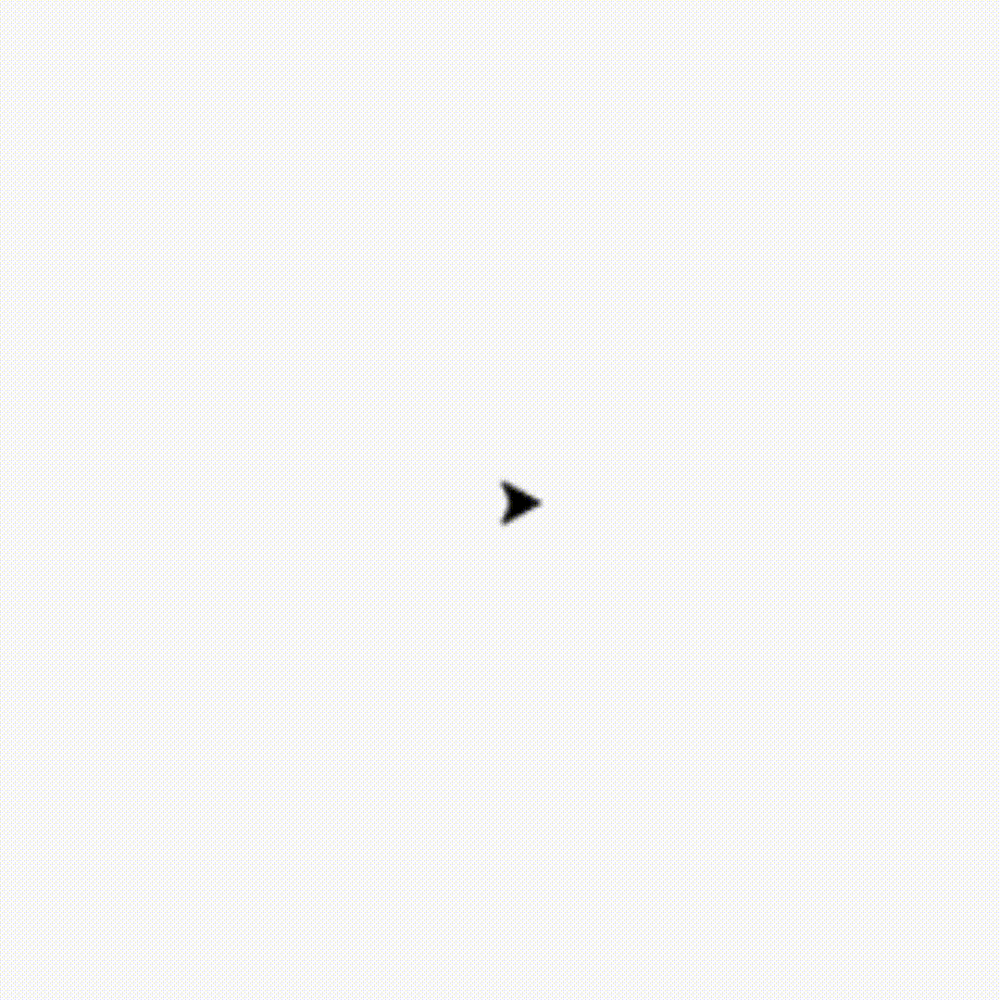

# Turtle Left & Right

### Prasyarat
Pemahaman dasar tentang pemrograman Python.

### Tujuan Pembelajaran
- Memahami cara mengendalikan arah gerakan turtle menggunakan `left()` dan `right()`.
- Memahami rotasi kiri dan kanan pada turtle.

---

## Definisi Turtle `left()` dan `right()`

Dalam pustaka **Turtle Graphics**, metode `left()` dan `right()` digunakan untuk memutar arah gerakan turtle berdasarkan sudut derajat yang diberikan, tanpa harus memindahkan posisinya. Ini berguna untuk mengatur arah turtle sebelum melanjutkan dengan perintah lainnya, seperti menggambar atau bergerak.

### Fungsi:

1. **`left(derajat)`**: Memutar arah turtle berlawanan arah jarum jam (kiri) sebesar derajat yang ditentukan.
   
   Contoh:
   ```python
   import turtle

   t = turtle.Turtle()

   # Putar turtle ke kiri sejauh 120 derajat
   t.left(120)

   turtle.done()
   ```
   Output:
   

2. **`right(derajat)`**: Memutar arah turtle searah jarum jam (kanan) sebesar derajat yang ditentukan.

   Contoh:
   ```python
   import turtle

   t = turtle.Turtle()

   # Putar turtle ke kanan sejauh 90 derajat
   t.right(90)

   turtle.done()
   ```
   Output:
   

---

## Contoh Penggunaan Gabungan `left()` dan `right()`

Anda bisa mengombinasikan kedua perintah ini untuk membuat pola rotasi tanpa menggerakkan turtle maju. Misalnya, jika ingin memutar turtle ke kiri 90 derajat lalu kembali ke posisi semula dengan memutar ke kanan:

```python
import turtle

t = turtle.Turtle()

# Putar ke kiri sejauh 90 derajat
t.left(90)

# Putar ke kanan sejauh 90 derajat
t.right(90)

turtle.done()
```

### Penggunaan Tambahan
Meskipun `left()` dan `right()` biasanya dikombinasikan dengan perintah lain seperti `forward()` untuk menggambar, perintah ini juga bisa digunakan secara mandiri untuk mengatur sudut atau arah dari turtle sesuai dengan kebutuhan.

---

## Kesimpulan

Perintah `left()` dan `right()` dalam pustaka **Turtle Graphics** memungkinkan pengaturan arah gerakan turtle dengan rotasi ke kiri atau ke kanan berdasarkan derajat yang ditentukan. Perintah ini sangat berguna untuk kontrol arah sebelum melakukan perintah lain dalam pembuatan gambar atau pola.


---

## Kuis

Apa yang dilakukan perintah `t.right(90)`?

- [ ] Memutar turtle ke kiri sebesar 90 derajat
- [ ] Memutar turtle ke kanan sebesar 90 derajat
- [ ] Menggerakkan turtle ke arah kanan sejauh 90 unit
- [ ] Menggerakkan turtle ke kanan tanpa memutar

---
<br/>
<br/>
<br/>


# Turtle Forward & Backward

### Prasyarat
Pemahaman dasar tentang pemrograman Python.

### Tujuan Pembelajaran
- Memahami cara menggerakkan turtle ke depan dan ke belakang menggunakan `forward()` dan `backward()`.
- Memahami konsep gerakan linear pada turtle.

---

## Definisi Turtle `forward()` dan `backward()`

Dalam pustaka **Turtle Graphics**, metode `forward()` dan `backward()` digunakan untuk menggerakkan turtle dalam arah tertentu, berdasarkan jarak yang ditentukan dalam satuan piksel (pixel). Gerakan ini dilakukan ke depan (searah arah yang sedang dihadapi turtle) atau ke belakang (berlawanan arah dengan yang sedang dihadapi turtle).

### Fungsi:

1. **`forward(jarak)`**: Menggerakkan turtle ke depan sejauh jarak yang ditentukan (dalam piksel), dalam arah yang sedang dihadapi oleh turtle.
   
   Contoh:
   ```python
   import turtle

   t = turtle.Turtle()

   # Gerakkan turtle ke depan sejauh 100 piksel
   t.forward(100)

   turtle.done()
   ```
   Output:
   

2. **`backward(jarak)`**: Menggerakkan turtle ke belakang sejauh jarak yang ditentukan (dalam piksel), dalam arah berlawanan dengan arah yang sedang dihadapi oleh turtle.

   Contoh:
   ```python
   import turtle

   t = turtle.Turtle()

   # Gerakkan turtle ke belakang sejauh 50 piksel
   t.backward(100)

   turtle.done()
   ```
   Output:
   

---

## Contoh Penggunaan Gabungan `forward()` dan `backward()`

Anda bisa mengombinasikan kedua perintah ini untuk membuat gerakan maju-mundur dengan mudah. Misalnya, untuk membuat turtle bergerak ke depan sejauh 150 piksel, lalu mundur kembali ke posisi awal:

```python
import turtle

t = turtle.Turtle()

# Gerakkan turtle ke depan sejauh 150 piksel
t.forward(150)

# Kembali ke posisi awal dengan mundur sejauh 150 piksel
t.backward(150)

turtle.done()
```

### Penggunaan Tambahan
Perintah `forward()` dan `backward()` sering dikombinasikan dengan perintah rotasi seperti `left()` dan `right()` untuk membuat pola atau gambar yang lebih kompleks.

---

## Kesimpulan

Perintah `forward()` dan `backward()` dalam pustaka **Turtle Graphics** digunakan untuk menggerakkan turtle ke depan atau ke belakang sejauh jarak yang ditentukan dalam piksel. Kedua perintah ini sangat berguna untuk membentuk gambar dengan gerakan linear sebelum mengatur arah baru menggunakan perintah rotasi.

---

## Kuis

Apa yang dilakukan perintah `t.forward(200)`?

- [ ] Menggerakkan turtle ke depan sejauh 200 piksel
- [ ] Memutar turtle ke kanan sejauh 200 derajat
- [ ] Memutar turtle ke kiri sejauh 200 derajat
- [ ] Menggerakkan turtle ke belakang sejauh 200 piksel

---
<br>
<br>
<br>

# Turtle Setposition

### Prasyarat
Pemahaman dasar tentang pemrograman Python.

### Tujuan Pembelajaran
- Memahami cara mengatur posisi turtle secara langsung menggunakan `setposition()` atau `setpos()`.
- Memahami koordinat kartesius dalam ruang gambar Turtle Graphics.

---

## Definisi Turtle `setposition()` atau `setpos()`

Dalam pustaka **Turtle Graphics**, metode `setposition()` (bisa juga disingkat `setpos()`) digunakan untuk memindahkan turtle ke titik tertentu dalam ruang gambar, berdasarkan koordinat yang ditentukan. Saat perintah ini digunakan, turtle akan menggambar jalur dari posisi sebelumnya ke posisi baru.

### Fungsi:

- **`setposition(x, y)` atau `setpos(x, y)`**: Memindahkan turtle ke koordinat `(x, y)` yang ditentukan dalam ruang gambar. Jalur yang digambar tergantung pada apakah pena (pen) sedang aktif atau tidak. Jika pena aktif, jalur akan tergambar; jika tidak, hanya turtle yang berpindah.

   Contoh:
   ```python
   import turtle

   t = turtle.Turtle()

   # Pindahkan turtle ke koordinat (100, 100)
   t.setposition(100, 100)

   # Pindahkan ke koordinat (-50, 50)
   t.setposition(-50, 50)

   turtle.done()
   ```

---

## Contoh Penggunaan Setposition untuk Membentuk Pola

Anda dapat menggunakan `setposition()` untuk menggambar pola dengan mengatur beberapa titik koordinat. Misalnya, membuat segitiga dengan menentukan tiga titik:

```python
import turtle

t = turtle.Turtle()

# Pindahkan turtle ke titik pertama
t.setposition(100, 0)

# Pindahkan ke titik kedua
t.setposition(50, 100)

# Kembali ke titik awal
t.setposition(0, 0)

turtle.done()
```

### Menggunakan `penup()` dan `pendown()`
Perintah `setposition()` sering digunakan bersamaan dengan `penup()` dan `pendown()`. Jika Anda ingin memindahkan turtle ke posisi baru tanpa menggambar jalur, gunakan `penup()` untuk mengangkat pena, lalu `pendown()` untuk menurunkan pena jika ingin mulai menggambar lagi.

Contoh:
```python
import turtle

t = turtle.Turtle()

# Angkat pena untuk berpindah tanpa menggambar
t.penup()
t.setposition(150, 150)

# Turunkan pena untuk mulai menggambar
t.pendown()
t.setposition(0, 0)

turtle.done()
```

---

## Kesimpulan

Perintah `setposition()` atau `setpos()` dalam pustaka **Turtle Graphics** memungkinkan Anda memindahkan turtle ke koordinat tertentu dalam ruang gambar. Perintah ini sangat berguna untuk mengatur posisi awal turtle atau membuat jalur menggambar yang kompleks dengan mengombinasikan pergerakan dan kontrol pena.

---

## Kuis

Apa yang dilakukan perintah `t.setposition(-100, 50)` jika pena aktif?

- [ ] Memutar turtle ke kiri sejauh 50 derajat
- [ ] Memindahkan turtle ke koordinat (-100, 50) tanpa menggambar
- [ ] Memindahkan turtle ke koordinat (-100, 50) dan menggambar jalur
- [ ] Menghapus jalur yang sudah digambar sebelumnya

---
<br>
<br>
<br>

# Turtle Setx & Sety

### Prasyarat
Pemahaman dasar tentang pemrograman Python.

### Tujuan Pembelajaran
- Memahami cara mengatur posisi turtle pada sumbu x dan y secara terpisah menggunakan `setx()` dan `sety()`.
- Memahami koordinat kartesius dalam ruang gambar Turtle Graphics.

---

## Definisi Turtle `setx()` dan `sety()`

Dalam pustaka **Turtle Graphics**, metode `setx()` dan `sety()` digunakan untuk memindahkan turtle ke posisi tertentu hanya pada sumbu x atau sumbu y, tanpa mengubah koordinat lainnya. Perintah ini berguna untuk memindahkan turtle secara horizontal atau vertikal.

### Fungsi:

1. **`setx(x)`**: Memindahkan turtle ke posisi x yang ditentukan, tanpa mengubah posisi pada sumbu y. Jika pena (pen) aktif, turtle akan menggambar jalur dari posisi sebelumnya ke posisi baru.

   Contoh:
   ```python
   import turtle

   t = turtle.Turtle()

   # Pindahkan turtle ke posisi x = 100, tanpa mengubah posisi y
   t.setx(100)

   turtle.done()
   ```

2. **`sety(y)`**: Memindahkan turtle ke posisi y yang ditentukan, tanpa mengubah posisi pada sumbu x. Jika pena aktif, jalur akan tergambar.

   Contoh:
   ```python
   import turtle

   t = turtle.Turtle()

   # Pindahkan turtle ke posisi y = 150, tanpa mengubah posisi x
   t.sety(150)

   turtle.done()
   ```

---

## Contoh Penggunaan Gabungan `setx()` dan `sety()`

Anda dapat menggunakan kedua perintah ini untuk memindahkan turtle ke posisi tertentu dengan mengatur koordinat x dan y secara terpisah. Misalnya, untuk memindahkan turtle secara horizontal lalu vertikal:

```python
import turtle

t = turtle.Turtle()

# Pindahkan turtle ke posisi x = 100
t.setx(100)

# Pindahkan turtle ke posisi y = 200
t.sety(200)

turtle.done()
```

### Menggunakan `penup()` dan `pendown()`
Seperti `setposition()`, perintah `setx()` dan `sety()` juga sering digunakan bersama dengan `penup()` dan `pendown()` untuk memindahkan turtle tanpa menggambar jalur.

Contoh:
```python
import turtle

t = turtle.Turtle()

# Angkat pena untuk berpindah tanpa menggambar
t.penup()
t.setx(-50)
t.sety(50)

# Turunkan pena untuk mulai menggambar
t.pendown()
t.setx(50)

turtle.done()
```

---

## Kesimpulan

Perintah `setx()` dan `sety()` dalam pustaka **Turtle Graphics** digunakan untuk memindahkan turtle secara horizontal atau vertikal tanpa mengubah koordinat lainnya. Perintah ini berguna untuk memindahkan turtle ke posisi yang diinginkan dengan lebih fleksibel, terutama saat mengatur pola atau jalur yang spesifik.

---

## Kuis

Apa yang dilakukan perintah `t.sety(75)` jika pena aktif?

- [ ] Memindahkan turtle ke posisi y = 75 dan menggambar jalur
- [ ] Memutar turtle ke kiri sejauh 75 derajat
- [ ] Memindahkan turtle ke posisi x = 75
- [ ] Menghapus jalur yang sudah digambar sebelumnya

---
<br>
<br>
<br>

# Turtle Setheading

### Prasyarat
Pemahaman dasar tentang pemrograman Python.

### Tujuan Pembelajaran
- Memahami cara mengatur arah turtle menggunakan `setheading()`.
- Memahami bagaimana sudut arah mempengaruhi gerakan turtle.

---

## Definisi Turtle `setheading()`

Dalam pustaka **Turtle Graphics**, metode `setheading()` digunakan untuk mengatur arah turtle ke sudut tertentu, diukur dalam derajat. Sudut dihitung searah jarum jam, dimulai dari arah ke timur (0 derajat). Dengan menggunakan `setheading()`, Anda dapat mengontrol ke mana turtle akan menghadap sebelum bergerak.

### Fungsi:

- **`setheading(sudut)`**: Mengatur arah turtle berdasarkan sudut yang ditentukan dalam derajat. Sudut diukur dari arah ke timur (0 derajat) searah jarum jam:
  - **0°**: Timur
  - **90°**: Utara
  - **180°**: Barat
  - **270°**: Selatan

   Contoh:
   ```python
   import turtle

   t = turtle.Turtle()

   # Atur arah turtle menghadap utara (90 derajat)
   t.setheading(90)
   t.forward(100)  # Bergerak ke atas

   # Atur arah turtle menghadap barat (180 derajat)
   t.setheading(180)
   t.forward(100)  # Bergerak ke kiri

   turtle.done()
   ```

---

## Contoh Penggunaan `setheading()`

Anda dapat menggunakan `setheading()` untuk menggambar bentuk tertentu dengan mengatur arah sebelum setiap pergerakan. Misalnya, membuat segiempat dengan mengatur arah di setiap sisi:

```python
import turtle

t = turtle.Turtle()

# Menggambar segiempat menggunakan setheading
for sudut in [0, 90, 180, 270]:
    t.setheading(sudut)
    t.forward(100)

turtle.done()
```

### Arah dan Rotasi
Dengan `setheading()`, Anda dapat secara langsung mengatur arah turtle ke sudut yang diinginkan tanpa harus menggunakan `left()` atau `right()`. Ini memudahkan pembuatan pola atau gambar yang memerlukan arah spesifik.

---

## Kesimpulan

Perintah `setheading()` dalam pustaka **Turtle Graphics** sangat berguna untuk mengontrol arah turtle dengan presisi. Dengan mengatur sudut arah secara langsung, Anda dapat membuat pola yang kompleks dan menggambar dengan lebih terstruktur.

---

## Kuis

Apa yang dilakukan perintah `t.setheading(270)`?

- [ ] Mengatur arah turtle ke barat
- [ ] Mengatur arah turtle ke selatan
- [ ] Menggerakkan turtle ke posisi (270, 0)
- [ ] Menghapus jalur yang sudah digambar sebelumnya

---
<br>
<br>
<br>

# Turtle Home

### Prasyarat
Pemahaman dasar tentang pemrograman Python.

### Tujuan Pembelajaran
- Memahami cara mengembalikan posisi turtle ke titik awal menggunakan `home()`.
- Mengetahui kegunaan fungsi `home()` dalam pengaturan gambar.

---

## Definisi Turtle `home()`

Dalam pustaka **Turtle Graphics**, metode `home()` digunakan untuk memindahkan turtle kembali ke posisi awalnya, yaitu titik (0, 0) pada koordinat kartesius. Selain memindahkan turtle, perintah ini juga mengatur arah turtle menghadap ke timur (0 derajat). Ini berguna ketika Anda ingin memulai kembali menggambar dari posisi awal.

### Fungsi:

- **`home()`**: Memindahkan turtle ke koordinat (0, 0) dan mengatur arah turtle menghadap timur.

   Contoh:
   ```python
   import turtle

   t = turtle.Turtle()

   # Pindahkan turtle ke beberapa posisi
   t.setposition(100, 100)
   t.setposition(-50, 50)

   # Kembali ke posisi awal
   t.home()

   turtle.done()
   ```

---

## Contoh Penggunaan `home()`

Perintah `home()` sangat berguna ketika Anda ingin kembali ke titik awal setelah menggambar, terutama saat bekerja pada gambar yang kompleks. Misalnya, menggambar pola dan kemudian kembali ke titik awal:

```python
import turtle

t = turtle.Turtle()

# Menggambar segiempat
for _ in range(4):
    t.forward(100)
    t.right(90)

# Kembali ke posisi awal
t.home()

turtle.done()
```

### Kombinasi dengan Perintah Lain
Anda dapat menggunakan `home()` bersama dengan perintah lain seperti `penup()` dan `pendown()` jika Anda ingin berpindah ke posisi awal tanpa menggambar jalur.

Contoh:
```python
import turtle

t = turtle.Turtle()

# Angkat pena untuk berpindah tanpa menggambar
t.penup()
t.setposition(100, 100)
t.pendown()

# Menggambar garis
t.forward(100)

# Kembali ke posisi awal
t.home()

turtle.done()
```

---

## Kesimpulan

Perintah `home()` dalam pustaka **Turtle Graphics** memudahkan untuk kembali ke posisi awal (0, 0) dan mengatur arah turtle. Ini berguna untuk memulai kembali proses menggambar dari titik yang telah ditentukan tanpa harus mengatur koordinat secara manual.

---

## Kuis

Apa yang dilakukan perintah `t.home()`?

- [ ] Menghapus semua jalur yang telah digambar
- [ ] Memindahkan turtle ke posisi (0, 0) dan mengatur arah ke timur
- [ ] Memindahkan turtle ke posisi acak dalam ruang gambar
- [ ] Mengatur arah turtle ke selatan dan memindahkannya ke (0, 0)

---
<br>
<br>
<br>

# Turtle Circle

### Prasyarat
Pemahaman dasar tentang pemrograman Python.

### Tujuan Pembelajaran
- Memahami cara menggambar lingkaran menggunakan `circle()`.
- Mengerti parameter yang digunakan dalam fungsi `circle()` untuk mengubah ukuran dan arah lingkaran.

---

## Definisi Turtle `circle()`

Dalam pustaka **Turtle Graphics**, metode `circle()` digunakan untuk menggambar lingkaran atau bagian dari lingkaran (busur) dengan jari-jari tertentu. Fungsi ini sangat berguna untuk menggambar bentuk bulat dan pola yang melibatkan lingkaran.

### Fungsi:

- **`circle(jari_jari, extent=None)`**: Menggambar lingkaran dengan jari-jari yang ditentukan. Parameter `extent` opsional dan digunakan untuk menggambar busur lingkaran. Jika `extent` tidak diberikan, maka lingkaran penuh akan digambar.

   - **`jari_jari`**: Jari-jari lingkaran yang ingin digambar.
   - **`extent`**: Sudut (dalam derajat) dari lingkaran yang ingin digambar. Jika tidak ada, menggambar lingkaran penuh (360 derajat).

   Contoh:
   ```python
   import turtle

   t = turtle.Turtle()

   # Menggambar lingkaran dengan jari-jari 50
   t.circle(50)

   turtle.done()
   ```

---

## Contoh Penggunaan `circle()`

Berikut adalah contoh penggunaan `circle()` untuk menggambar lingkaran penuh dan busur:

### Menggambar Lingkaran Penuh
```python
import turtle

t = turtle.Turtle()

# Menggambar lingkaran penuh dengan jari-jari 100
t.circle(100)

turtle.done()
```

### Menggambar Busur Lingkaran
Anda juga dapat menggambar busur dengan menentukan `extent`. Misalnya, untuk menggambar busur 180 derajat:
```python
import turtle

t = turtle.Turtle()

# Menggambar busur dengan jari-jari 50 dan 180 derajat
t.circle(50, 180)

turtle.done()
```

### Menggambar Lingkaran dengan Posisi dan Arah Berbeda
Anda bisa mengubah posisi turtle sebelum menggambar lingkaran. Misalnya:
```python
import turtle

t = turtle.Turtle()

# Pindahkan turtle ke posisi tertentu
t.penup()
t.setposition(0, -100)  # Memindahkan turtle ke bawah
t.pendown()

# Menggambar lingkaran dengan jari-jari 100
t.circle(100)

turtle.done()
```

---

## Kesimpulan

Perintah `circle()` dalam pustaka **Turtle Graphics** memungkinkan Anda menggambar lingkaran atau busur dengan mudah. Dengan mengatur jari-jari dan opsi `extent`, Anda dapat menggambar berbagai bentuk bulat yang berbeda untuk memperkaya gambar atau pola yang Anda buat.

---

## Kuis

Apa yang dilakukan perintah `t.circle(75, 180)`?

- [ ] Menggambar lingkaran penuh dengan jari-jari 75
- [ ] Menggambar busur lingkaran dengan jari-jari 75 dan sudut 180 derajat
- [ ] Menghapus lingkaran dengan jari-jari 75
- [ ] Mengganti arah turtle ke 180 derajat

---
<br>
<br>
<br>

# Turtle Dot

### Prasyarat
Pemahaman dasar tentang pemrograman Python.

### Tujuan Pembelajaran
- Memahami cara menggambar titik menggunakan `dot()`.
- Mengerti parameter yang digunakan dalam fungsi `dot()` untuk mengubah ukuran dan warna titik.

---

## Definisi Turtle `dot()`

Dalam pustaka **Turtle Graphics**, metode `dot()` digunakan untuk menggambar titik pada posisi turtle saat ini. Titik ini dapat diatur ukuran dan warnanya. Fungsi ini sangat berguna untuk menandai posisi tertentu dalam gambar atau untuk menggambar pola dengan titik.

### Fungsi:

- **`dot(ukuran, warna)`**: Menggambar titik dengan ukuran dan warna yang ditentukan. Parameter `warna` opsional dan dapat diisi dengan nama warna atau kode heksadesimal.

   - **`ukuran`**: Ukuran titik yang ingin digambar. Nilai default adalah 5.
   - **`warna`**: Warna titik yang ingin digambar. Jika tidak ditentukan, warna default adalah warna pena saat ini.

   Contoh:
   ```python
   import turtle

   t = turtle.Turtle()

   # Menggambar titik dengan ukuran 10 dan warna default
   t.dot(10)

   turtle.done()
   ```

---

## Contoh Penggunaan `dot()`

Berikut adalah beberapa contoh penggunaan `dot()` untuk menggambar titik:

### Menggambar Titik dengan Ukuran dan Warna yang Berbeda
```python
import turtle

t = turtle.Turtle()

# Menggambar titik dengan ukuran 20 dan warna merah
t.dot(20, "red")

# Pindahkan turtle untuk menggambar titik berikutnya
t.penup()
t.setposition(50, 50)
t.pendown()

# Menggambar titik dengan ukuran 15 dan warna biru
t.dot(15, "blue")

turtle.done()
```

### Menggambar Titik di Berbagai Posisi
Anda bisa memindahkan turtle ke posisi yang berbeda sebelum menggambar titik:
```python
import turtle

t = turtle.Turtle()

# Menggambar titik di posisi (0, 0)
t.dot(10, "green")

# Pindahkan turtle ke posisi lain
t.penup()
t.setposition(-50, -50)
t.pendown()

# Menggambar titik di posisi (-50, -50)
t.dot(10, "purple")

turtle.done()
```

### Menggambar Pola dengan Titik
Anda dapat menggunakan loop untuk menggambar pola titik:
```python
import turtle

t = turtle.Turtle()

# Menggambar pola titik
for i in range(10):
    t.dot(10, "orange")
    t.penup()
    t.forward(20)
    t.pendown()

turtle.done()
```

---

## Kesimpulan

Perintah `dot()` dalam pustaka **Turtle Graphics** memungkinkan Anda menggambar titik dengan ukuran dan warna yang dapat disesuaikan. Fungsi ini berguna untuk menandai posisi, membuat pola, atau menambah detail pada gambar yang Anda buat.

---

## Kuis

Apa yang dilakukan perintah `t.dot(30, "blue")`?

- [ ] Menggambar titik dengan ukuran 30 dan warna biru
- [ ] Menghapus titik yang sudah ada
- [ ] Mengganti warna pena menjadi biru
- [ ] Menggambar lingkaran dengan jari-jari 30

---
<br>
<br>
<br>

# Turtle Stamp & Clearstamp

### Prasyarat
Pemahaman dasar tentang pemrograman Python.

### Tujuan Pembelajaran
- Memahami cara menggambar stempel menggunakan `stamp()`.
- Memahami cara menghapus stempel yang telah dibuat dengan `clearstamp()`.

---

## Definisi Turtle `stamp()` dan `clearstamp()`

Dalam pustaka **Turtle Graphics**, metode `stamp()` digunakan untuk membuat stempel dari gambar turtle saat ini, sedangkan `clearstamp()` digunakan untuk menghapus stempel tertentu berdasarkan ID yang diberikan. Fungsi-fungsi ini berguna untuk menciptakan pola berulang tanpa harus menggambar ulang gambar setiap kali.

### Fungsi:

1. **`stamp()`**: Membuat stempel dari posisi dan bentuk turtle saat ini. Mengembalikan ID stempel yang dapat digunakan untuk menghapusnya di kemudian hari.

   Contoh:
   ```python
   import turtle

   t = turtle.Turtle()

   # Menggambar stempel
   stamp_id = t.stamp()

   turtle.done()
   ```

2. **`clearstamp(stamp_id)`**: Menghapus stempel yang telah dibuat berdasarkan ID yang diberikan.

   Contoh:
   ```python
   import turtle

   t = turtle.Turtle()

   # Menggambar stempel dan menyimpan ID
   stamp_id = t.stamp()

   # Menghapus stempel menggunakan ID
   t.clearstamp(stamp_id)

   turtle.done()
   ```

---

## Contoh Penggunaan `stamp()` dan `clearstamp()`

### Menggambar Stempel
Berikut adalah contoh menggambar beberapa stempel dan menghapus salah satunya:

```python
import turtle

t = turtle.Turtle()

# Menggambar stempel pertama
stamp_id1 = t.stamp()

# Pindahkan turtle untuk stempel berikutnya
t.penup()
t.setposition(50, 50)
t.pendown()

# Menggambar stempel kedua
stamp_id2 = t.stamp()

# Kembali ke posisi awal dan menghapus stempel pertama
t.penup()
t.home()
t.clearstamp(stamp_id1)

turtle.done()
```

### Menggambar Pola dengan Stempel
Anda dapat menggunakan `stamp()` dalam loop untuk membuat pola yang lebih kompleks. Berikut adalah contohnya:

```python
import turtle

t = turtle.Turtle()

# Menggambar pola dengan stempel
for i in range(5):
    t.stamp()  # Menggambar stempel di posisi saat ini
    t.forward(50)  # Bergerak maju
    t.right(72)  # Mengubah arah untuk pola bintang

turtle.done()
```

### Menghapus Semua Stempel
Jika Anda ingin menghapus semua stempel yang telah dibuat, Anda dapat menyimpan semua ID dan menghapus satu per satu, atau menggunakan pendekatan lain dengan mengingat semua stempel yang telah dibuat. Berikut adalah contohnya:

```python
import turtle

t = turtle.Turtle()
stamp_ids = []  # Daftar untuk menyimpan ID stempel

# Menggambar beberapa stempel dan menyimpan ID
for _ in range(5):
    stamp_ids.append(t.stamp())
    t.forward(30)

# Menghapus semua stempel yang telah dibuat
for stamp_id in stamp_ids:
    t.clearstamp(stamp_id)

turtle.done()
```

---

## Kesimpulan

Perintah `stamp()` dan `clearstamp()` dalam pustaka **Turtle Graphics** memungkinkan Anda untuk menciptakan dan menghapus stempel dari turtle dengan mudah. Ini berguna untuk membuat pola berulang dan mengelola gambar tanpa harus menggambar ulang setiap elemen.

---

## Kuis

Apa yang dilakukan perintah `t.clearstamp(stamp_id)`?

- [ ] Menghapus semua stempel yang telah dibuat
- [ ] Menghapus stempel berdasarkan ID yang diberikan
- [ ] Mengubah bentuk turtle menjadi stempel
- [ ] Menggambar stempel baru di posisi turtle saat ini

---
<br>
<br>
<br>

# Turtle Undo & Speed

### Prasyarat
Pemahaman dasar tentang pemrograman Python.

### Tujuan Pembelajaran
- Memahami cara membatalkan perintah terakhir menggunakan `undo()`.
- Mengerti bagaimana mengatur kecepatan turtle dengan `speed()`.

---

## Definisi Turtle `undo()` dan `speed()`

1. **`undo()`**: Metode ini digunakan untuk membatalkan perintah terakhir yang dijalankan oleh turtle. Ini berguna ketika Anda ingin membatalkan langkah yang tidak diinginkan tanpa harus mengulang seluruh proses menggambar.

   Contoh:
   ```python
   import turtle

   t = turtle.Turtle()

   # Menggambar garis
   t.forward(100)

   # Menggunakan undo untuk membatalkan pergerakan
   t.undo()

   turtle.done()
   ```

2. **`speed()`**: Metode ini digunakan untuk mengatur kecepatan pergerakan turtle. Anda dapat mengatur kecepatan dengan angka dari 0 hingga 10, di mana 0 adalah kecepatan maksimum (tanpa animasi), dan 1 adalah kecepatan paling lambat. Anda juga dapat menggunakan kata kunci seperti "fastest", "fast", "normal", "slow", dan "slowest".

   Contoh:
   ```python
   import turtle

   t = turtle.Turtle()

   # Mengatur kecepatan turtle ke maksimum
   t.speed(0)

   # Menggambar lingkaran
   t.circle(100)

   turtle.done()
   ```

---

## Contoh Penggunaan `undo()` dan `speed()`

### Menggunakan `undo()` untuk Membatalkan Perintah

Berikut adalah contoh penggunaan `undo()` untuk membatalkan langkah-langkah yang tidak diinginkan:

```python
import turtle

t = turtle.Turtle()

# Mengatur kecepatan turtle ke normal
t.speed(5)

# Menggambar garis
t.forward(100)

# Menghapus garis terakhir
t.undo()

# Menggambar garis baru
t.forward(50)

turtle.done()
```

### Mengatur Kecepatan Turtle

Anda dapat menggunakan `speed()` untuk mengatur seberapa cepat turtle bergerak. Berikut adalah contoh menggambar segitiga dengan kecepatan yang berbeda:

```python
import turtle

t = turtle.Turtle()

# Mengatur kecepatan turtle ke cepat
t.speed(3)

# Menggambar segitiga
for _ in range(3):
    t.forward(100)
    t.left(120)

turtle.done()
```

### Mengganti Kecepatan Selama Menggambar

Anda juga bisa mengubah kecepatan turtle saat menggambar:

```python
import turtle

t = turtle.Turtle()

# Mengatur kecepatan awal
t.speed(1)

# Menggambar segitiga lambat
for _ in range(3):
    t.forward(100)
    t.left(120)

# Mengubah kecepatan menjadi cepat
t.speed(10)

# Menggambar segitiga lebih cepat
for _ in range(3):
    t.forward(100)
    t.left(120)

turtle.done()
```

---

## Kesimpulan

Perintah `undo()` dalam pustaka **Turtle Graphics** memungkinkan Anda untuk membatalkan perintah terakhir, memberi Anda fleksibilitas dalam menggambar. Sementara itu, metode `speed()` memungkinkan Anda mengontrol kecepatan gerakan turtle, membuat proses menggambar lebih cepat atau lambat sesuai kebutuhan.

---

## Kuis

Apa yang dilakukan perintah `t.undo()`?

- [ ] Menghapus semua garis yang telah digambar
- [ ] Mengembalikan turtle ke posisi awal
- [ ] Membatalkan perintah terakhir yang dijalankan
- [ ] Mengubah kecepatan turtle menjadi lambat

---

Apa yang dilakukan perintah `t.speed(0)`?

- [ ] Mengatur turtle menjadi kecepatan paling lambat
- [ ] Mengatur turtle menjadi kecepatan maksimum
- [ ] Menghapus semua perintah yang telah dilakukan
- [ ] Menghentikan pergerakan turtle

---