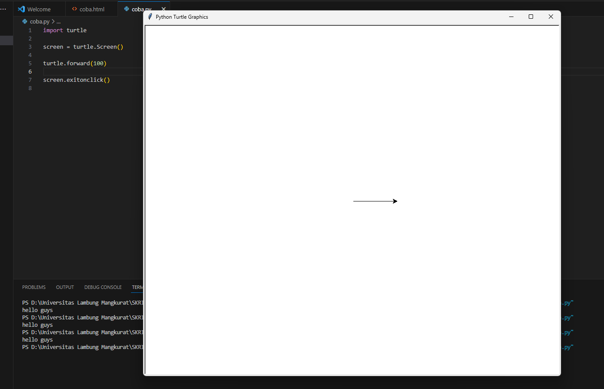

# forward() | fd()

Metode turtle.forward() digunakan untuk menggerakkan turtle ke depan berdasarkan nilai argumen yang dibutuhkan. Ini memberi garis untuk berpindah ke posisi atau arah lain.

```python
turtle.forward(jarak)
```
Argumen yang diperlukan adalah jarak { suatu bilangan (integer atau float) }. Jadi, ia menggerakkan penyu ke depan dengan jarak yang ditentukan, sesuai arah yang dituju penyu.

Contoh :
```python
turtle.forward(100)
```
output :

